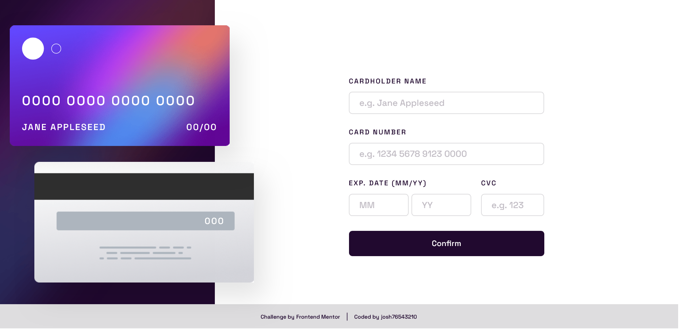

# Frontend Mentor - Interactive card details form solution

This is a solution to the [Interactive card details form challenge on Frontend Mentor](https://www.frontendmentor.io/challenges/interactive-card-details-form-XpS8cKZDWw). Frontend Mentor challenges help you improve your coding skills by building realistic projects.

## Table of contents

- [Overview](#overview)
  - [The challenge](#the-challenge)
  - [Screenshot](#screenshot)
  - [Links](#links)
- [My process](#my-process)
  - [Built with](#built-with)
  - [What I learned](#what-i-learned)
- [Author](#author)

## Overview

### The challenge

Users should be able to:

- Fill in the form and see the card details update in real-time
- Receive error messages when the form is submitted if:
  - Any input field is empty
  - The card number, expiry date, or CVC fields are in the wrong format
- View the optimal layout depending on their device's screen size
- See hover, active, and focus states for interactive elements on the page

### Screenshot



### Links

- Solution URL: [Add solution URL here]()
- Live Site URL: [Add live site URL here]()

## My process

### Built with

- HTML
- CSS
- JavaScript

### What I learned

Using JavaScript to make the interactive card details update in real time.

```js
// change name based on input
nameIn.oninput = function () {
  if (nameIn.value === "") cardNameEl.innerText = "Jane Appleseed";
  else cardNameEl.innerText = nameIn.value;
};

// change number based on input
numberIn.oninput = function () {
  if (numberIn.value === "") cardNumberEl.innerText = "0000 0000 0000 0000";
  else {
    // add spaces between number groups
    numberIn.value = numberIn.value
      .replace(/\s/g, "")
      .match(/(.{1,4})/g)
      .join(" ");
    cardNumberEl.innerText = numberIn.value;
  }
};

// change date based on input
monthIn.oninput = function () {
  if (yearIn.value === "" && monthIn.value === "")
    cardDateEl.innerText = "00/00";
  else if (yearIn.value === "") cardDateEl.innerText = `${monthIn.value}/00`;
  else cardDateEl.innerText = `${monthIn.value}/${yearIn.value}`;
};
yearIn.oninput = function () {
  if (yearIn.value === "" && monthIn.value === "")
    cardDateEl.innerText = "00/00";
  else if (monthIn.value === "") cardDateEl.innerText = `00/${yearIn.value}`;
  else cardDateEl.innerText = `${monthIn.value}/${yearIn.value}`;
};

// change cvc based on input
cvcIn.oninput = function () {
  if (cvcIn.value === "") cardCodeEl.innerText = "000";
  else cardCodeEl.innerText = cvcIn.value;
};
```

## Author

- Frontend Mentor - [@josh76543210](https://www.frontendmentor.io/profile/josh76543210)
- Twitter - [@josh76543210](https://www.twitter.com/josh76543210)
